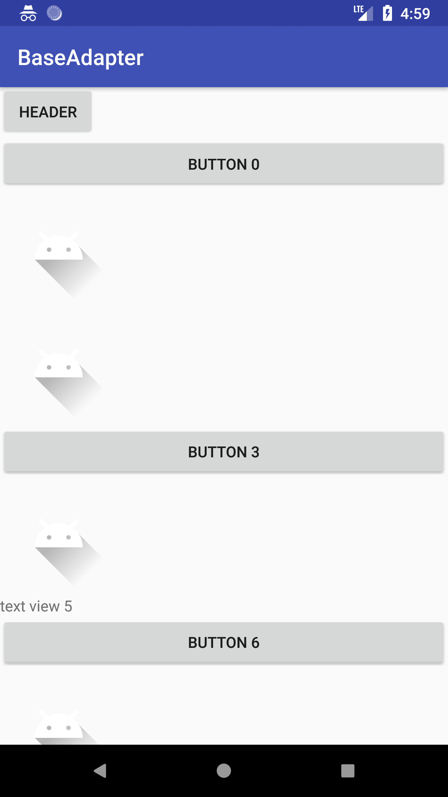
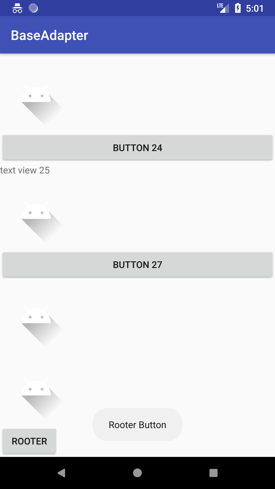

### 简介

多类型item的RecyclerView Adapter,支持添加头部和尾部View等功能

### 效果图

<figure class="half">

                                                              </figure>

### 依赖

```xml
implementation 'com.zzx:BaseAdapter:2.0.0'
```

### 源码下载

[  ](https://bintray.com/neuzzx/BaseAdapter/BaseAdapter/_latestVersion)

### 用法

- 实体类实现IEntity接口

  ~~~java
  public class TvEntity implements IEntity<TvEntity> {
  
      String text;
  
      public TvEntity(String content) {
          this.text = content;
      }
  
      @Override
      public View getLayoutView(LayoutInflater inflater) {
          return inflater.inflate(R.layout.item_tv, null);
      }
  
      @Override
      public void bindView(View rootView, final TvEntity data) {
          final TextView tv = rootView.findViewById(R.id.tv);
          tv.setText(data.text);
          tv.setOnClickListener(new View.OnClickListener() {
              @Override
              public void onClick(View v) {
                  Toast.makeText(tv.getContext(), data.text, Toast.LENGTH_SHORT).show();
              }
          });
      }
  }
  ~~~

- 创建BaseAdapter

  ~~~java
  mAdapter = new BaseAdapter.Builder()
                  .setDataList(mDataList)
                  .addHeader(headerBtn)
                  .addRooter(rooterBtn)
                  .build();
  ~~~

- 绑定RecyclerView

  ~~~java
  mRecycler.setAdapter(mAdapter);
  ~~~

  ### 作者简介

  白山黑水小码农

  email:1289042324@qq.com

  ### 协议

  <a href="http://www.apache.org/licenses/LICENSE-2.0">APACHE LICENSE-2.0</a> 